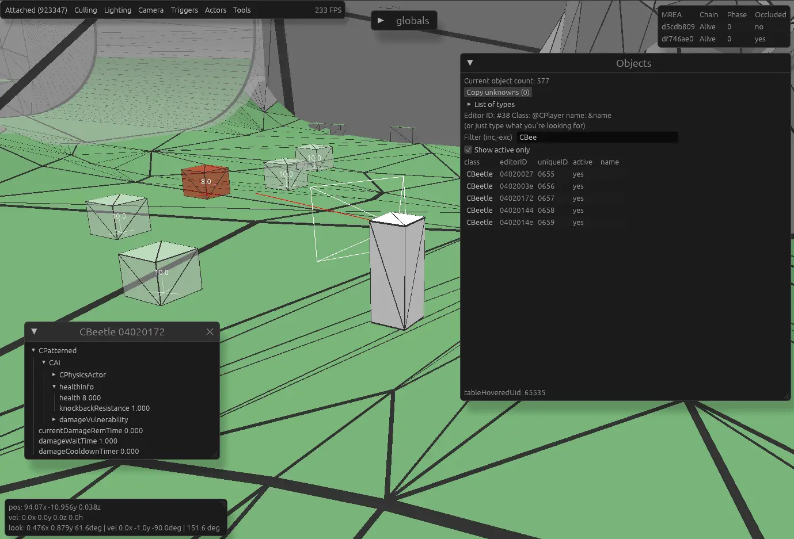

# Prime Watch 3

Live memory inspection and 3D world viewer for Metroid Prime 1 GCN, working from memory dumps or connected live to
Dolphin. Works on Windows; Linux and MacOS require a custom build of Dolphin.

## What it does

### Connecting

- It should automatically detect and attach to a running Dolphin. If you are running multiple
  instances, you will need to manually select which Dolphin to attach to.
- Load a memory dump (`mem1.raw` MEM1 image) to inspect a game state offline.

### 3D world view

- The room's collision geometry rebuilt from memory, with backface/frontface culling
  options
- Actors drawn in place — enemies/AI, projectiles, pickups, physics actors, and generic
  actors, each toggleable.
- Triggers visualized as boxes, filterable by what they detect
- Area status overlay: which rooms are loaded, their load chain/phase, occlusion state,
  and the current resource-streaming queue.
- Adjustable scene lighting and player ground shadow.

### Cameras

- Follow Player — orbit the player with the mouse.
- Game Cam — see through the actual in-game camera.
- Detached — free-fly camera with WASDQE + mouse look (hold `shift` to move faster).

Drag on the view to look/orbit, scroll to zoom (or dolly in Detached mode), middle-drag to
pan in Detached mode.

### Player ghosts

Record up to five position "ghosts" of the player and leave them in the world for
comparison. `shift+1..5` records a ghost, `ctrl+1..5` clears it.

### Object inspector

- globals window: some of the global objects used by the game, browsable for live values
- Objects browser: the full live entity list with a type breakdown and an
  include/exclude text filter. Hover a row to highlight that object in
  3D, or pin a watch window to a specific editor ID and follow it across rooms.
- Raw view: a hex dump of emulated memory.

### Analysis tools

- Collision triangle picker — hover the world to read the triangle index, material
  flags, and vertex positions under the cursor.
- Instant unmorph detection — indicate when the player's position would force an instant
  unmorph.
- Collision reposition failsafe — predicts whether the player is about to get pushed by
  the game's anti-clip failsafe, shows the push vector, and can tell you what would happen
  if you morphed on the spot (clean, nudged, or warped out of bounds through a wall seam).

### Scripting

Drop `.rhai` scripts in the `scripts/` folder. They run every frame against live memory and
can build their own inspector windows — useful for custom HUDs and readouts. Scripts
hot-reload, get glam vector/quaternion/matrix helpers, and can pin their windows to any
screen edge or corner. See `scripts/` for examples.

### Struct definitions

Struct definitions live in `prime_defs/` as editable `.bs` files and can be hot-reloaded
without restarting.

## Running

Unzip the release and run the `primewatch3` binary. Keep the `prime_defs/` and `scripts/`
folders next to it — they're loaded at startup.

Start Dolphin, load Metroid Prime, and Prime Watch will attach on its own.

## Version History

### 1.3.3
Perf improvements to platform rendering
Fix missing Ripper platform (i.e. MQA platform)

### 1.3.2
Add physics actor/platform rendering (including doors!)
Fix bitfield issues

### 1.3.1
Improved instant unmorph detection

### 1.3.0
Add reposition failsafe detection

### 1.2.0
Add instant unmorph detection and collision triangle picker

### 1.1.0
Add scripting engine

### 1.0.0
Initial release of the Rust rewrite.